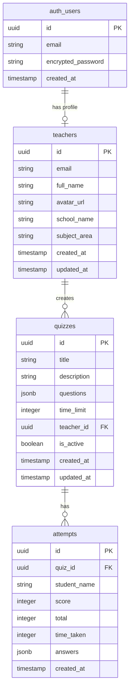

# LectureClosure Implementation Plan

## Executive Summary

This document outlines the implementation plan for making LectureClosure fully functional with Supabase authentication. The project is a React + Vite application for AI-powered quiz generation targeting Indian teachers.

---

## 1. Current State Analysis

### 1.1 Project Structure

```
LectureClosure/
├── src/
│   ├── lib/supabase.js          # Supabase client configuration
│   ├── context/AuthContext.jsx  # Authentication context provider
│   ├── services/
│   │   ├── authService.js       # Auth operations (signUp, signIn, signOut)
│   │   └── quizService.js       # Quiz CRUD operations
│   ├── components/
│   │   ├── ProtectedRoute.jsx   # Route guard component
│   │   ├── Header.jsx           # Navigation header
│   │   └── ...                  # Other UI components
│   └── pages/
│       ├── Landing.jsx          # Public landing page
│       ├── Login.jsx            # Login form
│       ├── Signup.jsx           # Registration form
│       ├── Dashboard.jsx        # Teacher dashboard (protected)
│       ├── QuizCreate.jsx       # Quiz creation wizard (protected)
│       ├── Quiz.jsx             # Quiz taking interface
│       ├── QuizStart.jsx        # Quiz start page
│       └── Leaderboard.jsx      # Quiz leaderboard
├── .env                         # Environment variables
└── package.json                 # Dependencies
```

### 1.2 What's Already Working

| Component | Status | Notes |
|-----------|--------|-------|
| Supabase Client | ✅ Configured | Uses VITE_SUPABASE_URL and VITE_SUPABASE_ANON_KEY |
| Environment Variables | ✅ Present | Both required variables are set |
| Auth Context | ✅ Structured | Proper React Context with useAuth hook |
| Auth Service | ✅ Implemented | signUp, signIn, signOut, getSession, getTeacherProfile |
| Quiz Service | ✅ Implemented | createQuiz, getQuiz, saveAttempt, getLeaderboard, getTeacherStats |
| Protected Routes | ✅ Working | Uses isAuthenticated and loading states |
| Login/Signup Pages | ✅ UI Complete | Forms with validation and error handling |
| Dashboard | ✅ UI Complete | Shows quizzes and stats |
| QuizCreate | ✅ UI Complete | File upload wizard with demo questions |

### 1.3 Dependencies

```json
{
  "@supabase/supabase-js": "^2.95.3",
  "framer-motion": "^12.33.0",
  "lucide-react": "^0.563.0",
  "react": "^19.2.0",
  "react-dom": "^19.2.0",
  "react-router-dom": "^7.13.0"
}
```

---

## 2. Issues Found

### 2.1 Critical Issues

#### Issue 1: Missing Database Tables
**Severity: Critical** | **Impact: App will not function**

The application references three database tables that do not exist in Supabase:
- `teachers` - User profiles linked to auth.users
- `quizzes` - Quiz storage with questions
- `attempts` - Student quiz attempts for leaderboard

#### Issue 2: Missing Row Level Security (RLS) Policies
**Severity: Critical** | **Impact: Security vulnerability**

Without RLS policies:
- Data is either completely inaccessible or exposed to all users
- Teachers could see other teachers' quizzes
- Students could modify leaderboard entries

#### Issue 3: No Null Check for Supabase Client
**Severity: High** | **Impact: Runtime errors in demo mode**

The service files import `supabase` but don't check if it's null before calling methods. If environment variables are missing, all service calls will throw errors.

```javascript
// Current code in authService.js line 9
const { data: authData, error: authError } = await supabase.auth.signUp({...});
// Will throw "Cannot read properties of null" if supabase is null
```

### 2.2 Medium Priority Issues

#### Issue 4: Email Confirmation Flow
**Severity: Medium** | **Impact: User experience**

The signup flow assumes immediate access after registration, but Supabase may require email confirmation. The current code:
- Redirects to dashboard immediately after signup
- Does not handle "check your email" scenario

#### Issue 5: Missing Password Reset
**Severity: Medium** | **Impact: User experience**

No forgot password or password reset functionality exists.

#### Issue 6: No Profile Update Function
**Severity: Medium** | **Impact: Feature gap**

Teachers cannot update their profile information after registration.

### 2.3 Low Priority Issues

#### Issue 7: No Demo Mode Fallback
**Severity: Low** | **Impact: Developer experience**

When Supabase is not configured, the app shows warnings but doesn't provide a proper demo mode with mock data.

#### Issue 8: Missing Error Boundaries
**Severity: Low** | **Impact: User experience**

No React error boundaries to gracefully handle runtime errors.

---

## 3. Required Supabase Database Schema

### 3.1 SQL Schema

Run the following SQL in Supabase SQL Editor:

```sql
-- ============================================
-- LECTURECLOSURE DATABASE SCHEMA
-- ============================================

-- Enable UUID extension if not already enabled
CREATE EXTENSION IF NOT EXISTS "uuid-ossp";

-- ============================================
-- 1. TEACHERS TABLE
-- Stores teacher profile information
-- ============================================
CREATE TABLE IF NOT EXISTS teachers (
    id UUID PRIMARY KEY REFERENCES auth.users(id) ON DELETE CASCADE,
    email TEXT NOT NULL,
    full_name TEXT NOT NULL,
    avatar_url TEXT,
    school_name TEXT,
    subject_area TEXT,
    created_at TIMESTAMPTZ DEFAULT NOW(),
    updated_at TIMESTAMPTZ DEFAULT NOW()
);

-- Create index for faster email lookups
CREATE INDEX IF NOT EXISTS idx_teachers_email ON teachers(email);

-- ============================================
-- 2. QUIZZES TABLE
-- Stores quiz data with questions as JSONB
-- ============================================
CREATE TABLE IF NOT EXISTS quizzes (
    id UUID PRIMARY KEY DEFAULT uuid_generate_v4(),
    title TEXT NOT NULL,
    description TEXT,
    questions JSONB NOT NULL DEFAULT '[]',
    time_limit INTEGER DEFAULT 600, -- Time in seconds (default: 10 minutes)
    teacher_id UUID REFERENCES teachers(id) ON DELETE CASCADE,
    is_active BOOLEAN DEFAULT true,
    created_at TIMESTAMPTZ DEFAULT NOW(),
    updated_at TIMESTAMPTZ DEFAULT NOW()
);

-- Create indexes for common queries
CREATE INDEX IF NOT EXISTS idx_quizzes_teacher_id ON quizzes(teacher_id);
CREATE INDEX IF NOT EXISTS idx_quizzes_created_at ON quizzes(created_at DESC);
CREATE INDEX IF NOT EXISTS idx_quizzes_is_active ON quizzes(is_active);

-- ============================================
-- 3. ATTEMPTS TABLE
-- Stores student quiz attempts for leaderboard
-- ============================================
CREATE TABLE IF NOT EXISTS attempts (
    id UUID PRIMARY KEY DEFAULT uuid_generate_v4(),
    quiz_id UUID NOT NULL REFERENCES quizzes(id) ON DELETE CASCADE,
    student_name TEXT NOT NULL,
    score INTEGER NOT NULL,
    total INTEGER NOT NULL,
    time_taken INTEGER, -- Time in seconds
    answers JSONB, -- Optional: store individual answers
    created_at TIMESTAMPTZ DEFAULT NOW()
);

-- Create indexes for leaderboard queries
CREATE INDEX IF NOT EXISTS idx_attempts_quiz_id ON attempts(quiz_id);
CREATE INDEX IF NOT EXISTS idx_attempts_score ON attempts(score DESC);
CREATE INDEX IF NOT EXISTS idx_attempts_created_at ON attempts(created_at DESC);

-- ============================================
-- 4. ROW LEVEL SECURITY POLICIES
-- ============================================

-- Enable RLS on all tables
ALTER TABLE teachers ENABLE ROW LEVEL SECURITY;
ALTER TABLE quizzes ENABLE ROW LEVEL SECURITY;
ALTER TABLE attempts ENABLE ROW LEVEL SECURITY;

-- ============================================
-- TEACHERS POLICIES
-- ============================================

-- Teachers can view their own profile
CREATE POLICY "Teachers can view own profile"
    ON teachers FOR SELECT
    USING (auth.uid() = id);

-- Teachers can update their own profile
CREATE POLICY "Teachers can update own profile"
    ON teachers FOR UPDATE
    USING (auth.uid() = id);

-- Allow insert during signup (service role handles this via trigger)
CREATE POLICY "Allow insert during signup"
    ON teachers FOR INSERT
    WITH CHECK (auth.uid() = id);

-- ============================================
-- QUIZZES POLICIES
-- ============================================

-- Teachers can view their own quizzes
CREATE POLICY "Teachers can view own quizzes"
    ON quizzes FOR SELECT
    USING (teacher_id = auth.uid());

-- Anyone can view active quizzes (for students taking quiz)
CREATE POLICY "Anyone can view active quizzes"
    ON quizzes FOR SELECT
    USING (is_active = true);

-- Teachers can create quizzes
CREATE POLICY "Teachers can create quizzes"
    ON quizzes FOR INSERT
    WITH CHECK (teacher_id = auth.uid());

-- Teachers can update their own quizzes
CREATE POLICY "Teachers can update own quizzes"
    ON quizzes FOR UPDATE
    USING (teacher_id = auth.uid());

-- Teachers can delete their own quizzes
CREATE POLICY "Teachers can delete own quizzes"
    ON quizzes FOR DELETE
    USING (teacher_id = auth.uid());

-- ============================================
-- ATTEMPTS POLICIES
-- ============================================

-- Anyone can create attempts (students taking quiz)
CREATE POLICY "Anyone can create attempts"
    ON attempts FOR INSERT
    WITH CHECK (true);

-- Anyone can view attempts (for leaderboard)
CREATE POLICY "Anyone can view attempts"
    ON attempts FOR SELECT
    USING (true);

-- ============================================
-- 5. FUNCTIONS AND TRIGGERS
-- ============================================

-- Function to automatically create teacher profile on user signup
CREATE OR REPLACE FUNCTION public.handle_new_user()
RETURNS TRIGGER AS $$
BEGIN
    INSERT INTO public.teachers (id, email, full_name)
    VALUES (
        NEW.id,
        NEW.email,
        COALESCE(NEW.raw_user_meta_data->>'full_name', 'Teacher')
    );
    RETURN NEW;
END;
$$ LANGUAGE plpgsql SECURITY DEFINER;

-- Trigger to call the function on user creation
DROP TRIGGER IF EXISTS on_auth_user_created ON auth.users;
CREATE TRIGGER on_auth_user_created
    AFTER INSERT ON auth.users
    FOR EACH ROW
    EXECUTE FUNCTION public.handle_new_user();

-- Function to update updated_at timestamp
CREATE OR REPLACE FUNCTION public.handle_updated_at()
RETURNS TRIGGER AS $$
BEGIN
    NEW.updated_at = NOW();
    RETURN NEW;
END;
$$ LANGUAGE plpgsql;

-- Triggers for updated_at
DROP TRIGGER IF EXISTS on_teachers_updated ON teachers;
CREATE TRIGGER on_teachers_updated
    BEFORE UPDATE ON teachers
    FOR EACH ROW
    EXECUTE FUNCTION public.handle_updated_at();

DROP TRIGGER IF EXISTS on_quizzes_updated ON quizzes;
CREATE TRIGGER on_quizzes_updated
    BEFORE UPDATE ON quizzes
    FOR EACH ROW
    EXECUTE FUNCTION public.handle_updated_at();

-- ============================================
-- 6. SAMPLE DATA (Optional - for testing)
-- ============================================

-- Uncomment to add sample data after creating a user
-- INSERT INTO quizzes (title, questions, time_limit)
-- VALUES (
--     'Sample Biology Quiz',
--     '[
--         {"id": 1, "text": "What is the primary role of mitochondria?", "options": ["Energy production", "Protein synthesis", "Cell division", "DNA replication"], "correct": 0},
--         {"id": 2, "text": "Which describes anaerobic respiration?", "options": ["Requires oxygen", "Occurs without oxygen", "Produces more ATP", "Only in plants"], "correct": 1}
--     ]'::jsonb,
--     600
-- );
```

### 3.2 Schema Diagram



---

## 4. Implementation Steps for Code Mode

### Phase 1: Database Setup (Supabase Dashboard)

| Step | Task | Details |
|------|------|---------|
| 1.1 | Run SQL Schema | Execute the SQL from Section 3.1 in Supabase SQL Editor |
| 1.2 | Verify Tables | Check that teachers, quizzes, attempts tables exist |
| 1.3 | Verify RLS | Confirm RLS is enabled with correct policies |
| 1.4 | Test Trigger | Create a test user and verify teacher profile is auto-created |

### Phase 2: Code Fixes

| Step | File | Task |
|------|------|------|
| 2.1 | `src/services/authService.js` | Add null check for supabase client |
| 2.2 | `src/services/quizService.js` | Add null check for supabase client |
| 2.3 | `src/services/authService.js` | Add password reset function |
| 2.4 | `src/services/authService.js` | Add profile update function |
| 2.5 | `src/context/AuthContext.jsx` | Handle email confirmation scenario |
| 2.6 | `src/pages/Signup.jsx` | Show email confirmation message if required |

### Phase 3: New Features

| Step | File | Task |
|------|------|------|
| 3.1 | `src/pages/ForgotPassword.jsx` | Create forgot password page |
| 3.2 | `src/pages/ResetPassword.jsx` | Create reset password page |
| 3.3 | `src/App.jsx` | Add routes for password reset pages |
| 3.4 | `src/pages/Profile.jsx` | Create profile management page |
| 3.5 | `src/services/authService.js` | Add updateProfile function |

### Phase 4: Testing

| Step | Task | Details |
|------|------|---------|
| 4.1 | Test Signup | Create new account, verify profile creation |
| 4.2 | Test Login | Login with created credentials |
| 4.3 | Test Quiz Creation | Create a quiz, verify database entry |
| 4.4 | Test Quiz Taking | Take quiz as student, verify attempt saved |
| 4.5 | Test Leaderboard | Verify leaderboard shows attempts correctly |
| 4.6 | Test Protected Routes | Verify unauthenticated users redirected |

---

## 5. Code Changes Required

### 5.1 authService.js - Add Null Checks

```javascript
// Add at the beginning of each function that uses supabase
import { supabase, isSupabaseConfigured } from '../lib/supabase';

export const signUp = async ({ email, password, fullName }) => {
    if (!isSupabaseConfigured) {
        return { user: null, error: 'Supabase is not configured. Please set up your .env file.' };
    }
    // ... rest of function
};
```

### 5.2 authService.js - Add Password Reset

```javascript
export const resetPassword = async (email) => {
    if (!isSupabaseConfigured) {
        return { error: 'Supabase is not configured.' };
    }
    
    try {
        const { error } = await supabase.auth.resetPasswordForEmail(email, {
            redirectTo: `${window.location.origin}/reset-password`,
        });
        
        if (error) throw error;
        return { error: null };
    } catch (error) {
        return { error: error.message };
    }
};

export const updatePassword = async (newPassword) => {
    if (!isSupabaseConfigured) {
        return { error: 'Supabase is not configured.' };
    }
    
    try {
        const { error } = await supabase.auth.updateUser({
            password: newPassword
        });
        
        if (error) throw error;
        return { error: null };
    } catch (error) {
        return { error: error.message };
    }
};
```

### 5.3 authService.js - Add Profile Update

```javascript
export const updateProfile = async (userId, updates) => {
    if (!isSupabaseConfigured) {
        return { error: 'Supabase is not configured.' };
    }
    
    try {
        const { data, error } = await supabase
            .from('teachers')
            .update(updates)
            .eq('id', userId)
            .select()
            .single();
            
        if (error) throw error;
        return { profile: data, error: null };
    } catch (error) {
        return { profile: null, error: error.message };
    }
};
```

### 5.4 Signup.jsx - Handle Email Confirmation

```javascript
// After signUp call, check if session exists
const { user, error } = await signUp({ email, password, fullName });

if (error) {
    setError(error);
} else if (user && !user.email_confirmed_at) {
    // Email confirmation required
    setEmailSent(true);
} else if (user) {
    setSuccess(true);
    setTimeout(() => navigate('/dashboard'), 2000);
}
```

---

## 6. Supabase Dashboard Configuration

### 6.1 Authentication Settings

Navigate to: **Authentication → Providers**

| Setting | Recommended Value |
|---------|-------------------|
| Enable Email Provider | ✅ Enabled |
| Confirm Email | Enable for production, disable for development |
| Secure Email Change | ✅ Enabled |
| Secure Password Change | ✅ Enabled |

### 6.2 URL Configuration

Navigate to: **Authentication → URL Configuration**

| Setting | Value |
|---------|-------|
| Site URL | `http://localhost:5173` (development) |
| Redirect URLs | Add your production domain |

### 6.3 Email Templates (Optional)

Navigate to: **Authentication → Email Templates**

Customize templates for:
- Confirmation email
- Password reset email
- Magic link email

---

## 7. Environment Variables Checklist

Ensure `.env` file contains:

```env
# Required
VITE_SUPABASE_URL=https://your-project.supabase.co
VITE_SUPABASE_ANON_KEY=your-anon-key

# Optional (for future features)
VITE_APP_NAME=LectureClosure
VITE_APP_URL=http://localhost:5173
```

---

## 8. Testing Checklist

### 8.1 Authentication Flow

- [ ] User can sign up with email and password
- [ ] Teacher profile is automatically created
- [ ] User can log in with credentials
- [ ] User can log out successfully
- [ ] Protected routes redirect to login when not authenticated
- [ ] After login, user is redirected to intended page

### 8.2 Quiz Flow

- [ ] Teacher can create a new quiz
- [ ] Quiz appears in dashboard
- [ ] Student can access quiz via share link
- [ ] Student can submit quiz answers
- [ ] Attempt is saved to database
- [ ] Leaderboard shows attempt correctly

### 8.3 Error Handling

- [ ] Graceful error messages for auth failures
- [ ] Graceful error messages for network issues
- [ ] Demo mode works when Supabase not configured

---

## 9. Deployment Notes

### 9.1 Before Deployment

1. Update Supabase URL configuration with production domain
2. Enable email confirmation in Supabase
3. Review and test RLS policies
4. Set up proper error tracking (e.g., Sentry)

### 9.2 Environment Variables

Set these in your deployment platform:
- `VITE_SUPABASE_URL`
- `VITE_SUPABASE_ANON_KEY`

---

## 10. Summary

The LectureClosure application has a solid foundation with:
- Proper React architecture with Context API
- Well-structured service layer
- Complete UI components for all major flows

The primary work needed is:
1. **Database setup** - Run the SQL schema in Supabase
2. **Null checks** - Add safety checks for demo mode
3. **Password reset** - Add forgot/reset password functionality
4. **Email confirmation** - Handle the confirmation flow

Once the database schema is applied and the code fixes are implemented, the application will be fully functional with Supabase authentication.
